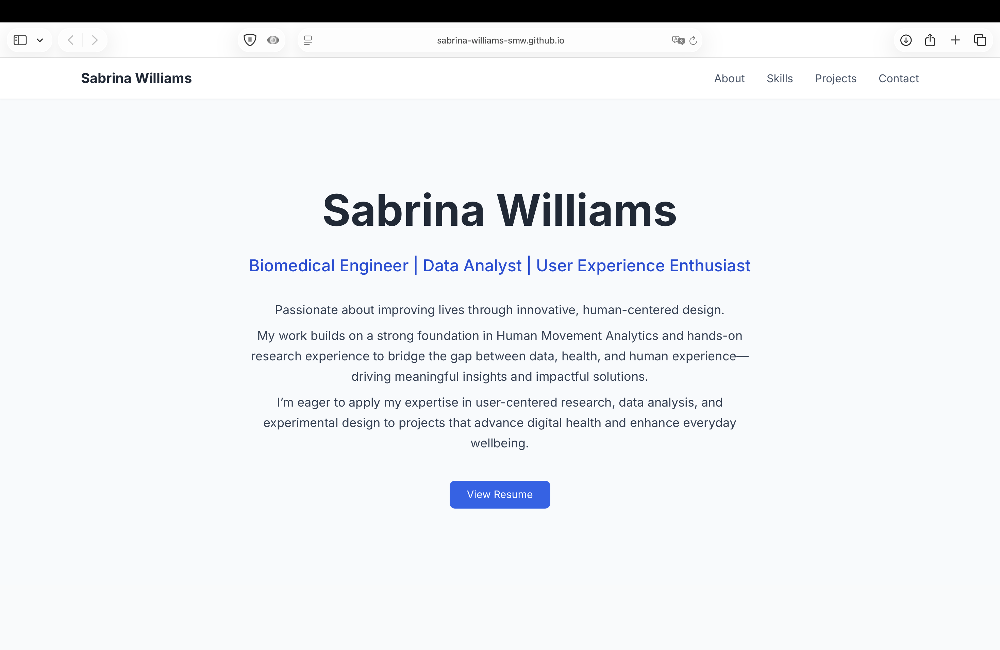
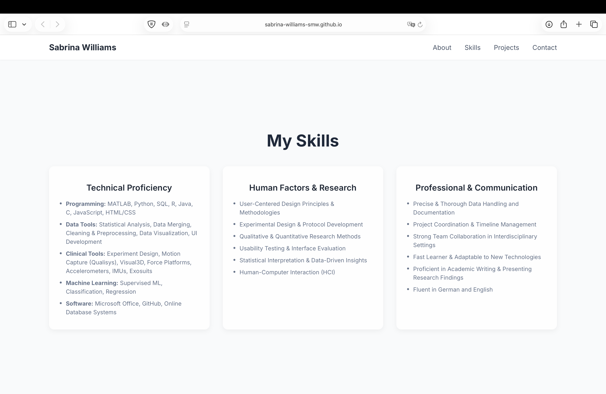
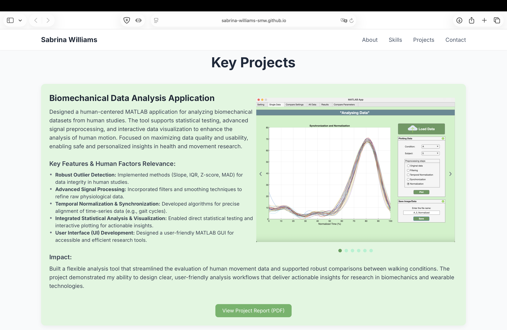
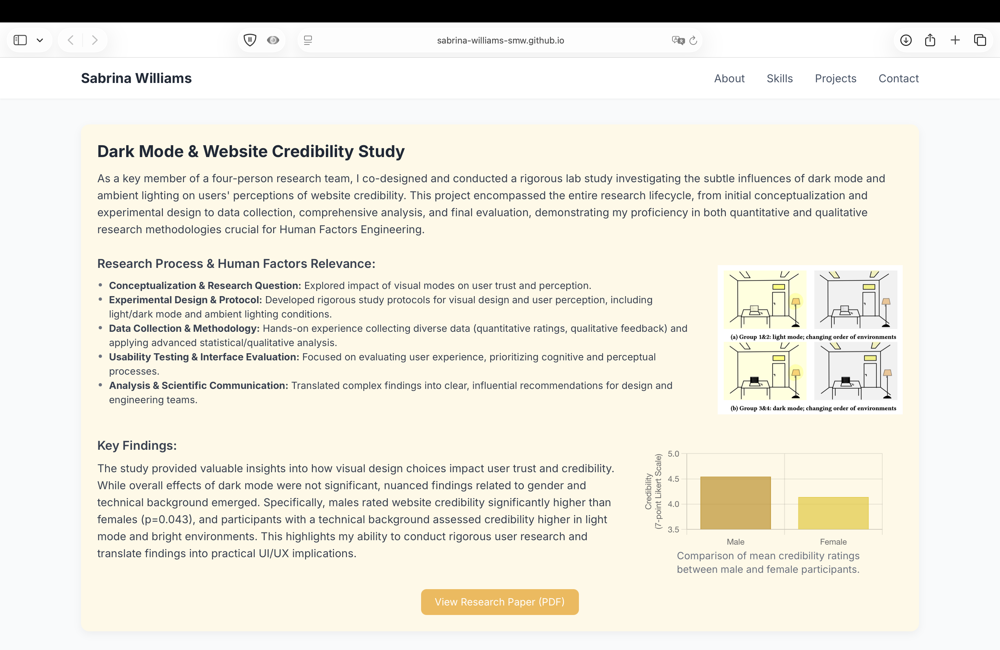
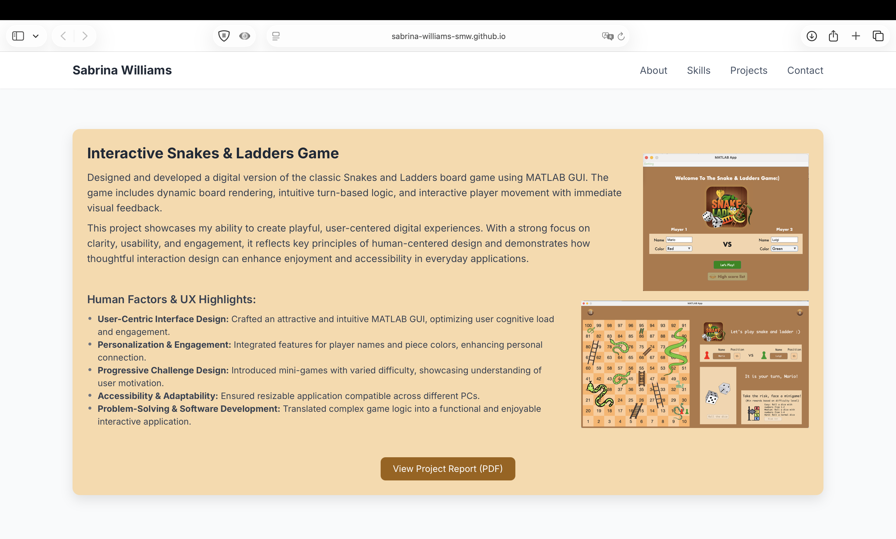

# Sabrina Williams – Biomedical Engineer Portfolio

This repository contains my personal portfolio website showcasing my background, skills, and projects in **Biomedical Engineering, Data Analysis, and Human Factors Design**.  
The portfolio highlights my technical proficiency, research experience, and selected key projects.

👉 **Live Demo:** [View Portfolio](https://sabrina-williams-smw.github.io/Portfolio_projects/)

---

## 🔹 Features
- Responsive, modern design with **Tailwind CSS**
- Interactive project sections with sliders and visuals
- Downloadable **US Resume** and **European CV**
- Smooth navigation with anchor links
- Links to detailed project reports (PDFs)

---

## 🔹 Technologies Used
- **HTML5, CSS3**
- **Tailwind CSS**
- **JavaScript**
- **Chart.js** (for data visualizations)

---

## 🔹 Screenshots

### Hero Section


### Skills Section


### Project 1 – Biomechanical Data Analysis Application


### Project 2 – Dark Mode & Website Credibility Study


### Project 3 – Interactive Snakes & Ladders Game


### Contact Section


---

## 🔹 How to Run Locally
Clone the repository and open `index.html` in your browser:

```bash
git clone git@github.com:sabrina-williams-smw/Portfolio_projects.git
cd Portfolio_projects
open index.html   # On macOS
